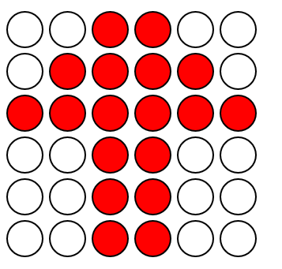
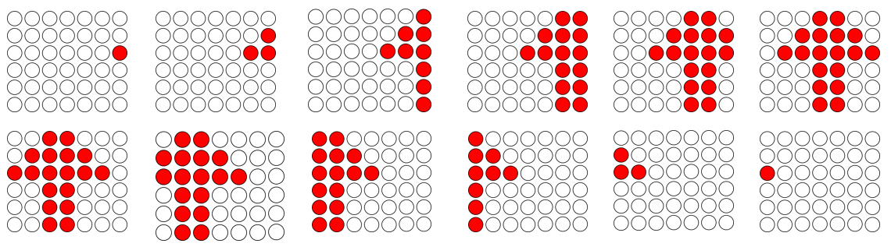

# Problema

El grupo de baile "Los Kareltastikos" quiere crear un nuevo espectáculo atractivo para todo el mundo. Para esto diseñaron un escenario muy especial, el cual puede verse como un rectángulo de dimensiones $N \times M$. Cada posición del rectángulo cuenta con un reflector. Los Kareltastikos decidieron que su espectáculo tendría como enfoque principal un patrón. El patrón deberá ser de una figura de dimensiones $N \times K$, es decir, la altura debe coincidir con el escenario.

Los bailarines irán saliendo de izquierda a derecha recreando el patrón poco a poco. En el primer minuto, la última columna del escenario pasará a ser la primera del patrón, de allí en adelante toda columna $i$ se desplazará a la izquierda y la última columna pasará a ser la del patrón en el tiempo correspondiente, así hasta que la última columna recorra toda la matriz. Por ejemplo, imagina que tenemos la siguiente figura.

Si el escenario es una columna más ancha, el espectáculo se vería como el siguiente en cada momento.

Lamentablemente, algunos reflectores se encuentran disfuncionales. El grupo de baile se pregunta si su espectáculo se verá igual con el escenario actual.

# Entrada

Se te darán los enteros $1 \leq N, M, K \leq 100$ representando las dimensiones del patrón y del escenario.

En la siguiente línea se te describirá el escenario como una matriz de $N \times M$ donde el carácter '*' indica que el reflector es funcional mientras que el carácter '-' indica que no es funcional.

Luego, se te describirá el patrón como una matriz de $N \times M$ donde el carácter '*' indica que allí debe haber un bailarín mientras que el carácter '-' indica que allí no debe haber ningún bailarín.

# Salida

Deberás imprimir 'S' en caso de que el patrón pueda ser mostrado sin problema, 'N' de caso contrario.

# Ejemplos

||input
3 3 3
*** -*-
--- ---
*** *-*
||output
S
||input
5 4 3
**** ---
---- ***
**** ---
---- ***
**** ---
||output
N
||input
3 3 3
*** -*-
*-* -*-
*** *-*
||output
N
||end