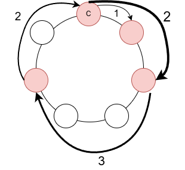

# Problema

En la escuela de Cristian les encanta hacer actividades deportivas. Cada año organizan un concurso donde los alumnos forman equipos y compiten en diferentes pruebas. Sin embargo, formar los equipos siempre ha sido muy aburrido… ¡hasta que Cristian propuso una nueva y divertida forma de hacerlo!

Hay $N$ alumnos formados en una fila. Además, se dibuja una circunferencia con $L$ posiciones disponibles. Cristian es el primero en la fila, y será el primero en colocarse en alguna posición de la circunferencia.

Después de Cristian, cada uno de los siguientes $N - 1$ alumnos elige un número positivo. A estos números los llamamos $a_1, a_2, \ldots, a_{N-1}$.

Luego, los alumnos se colocan uno por uno de la siguiente manera:

- Cristian elige una posición inicial (no importa cuál).

- El siguiente alumno se coloca $a_1$ posiciones después de Cristian (siguiendo el sentido horario).

- El siguiente se coloca $a_2$ posiciones después del anterior, y así sucesivamente hasta que todos estén ubicados.

Como están en una circunferencia, si alguien se pasa del lugar $L$, simplemente continúa desde el inicio (como si la circunferencia se "reiniciara").

Al final, los alumnos que queden en la misma posición forman un equipo. Tu tarea es contar cuántos equipos distintos se forman, es decir, cuántas posiciones distintas tienen al menos un alumno.

## Ejemplo

Supongamos que hay 5 alumnos, 7 lugares en la circunferencia, y los números elegidos son:
$[2, 3, 2, 1]$

La secuencia de colocación se vería como en la imagen siguiente, donde $C$ representa la posición que eligió Cristian:

En este caso, se forman 4 equipos.

# Entrada

La primera línea contiene dos enteros $N$ y $L$: la cantidad de alumnos y la cantidad de posiciones en la circunferencia.

La segunda línea contiene $N-1$ enteros $a_1, a_2, \dots, a_{N-1}$: los números elegidos por los compañeros de Cristian.

# Salida

Imprime un solo número: la cantidad de equipos formados al final.

# Ejemplos

||input
5 7
2 3 2 1
||output
4
||description
Caso descrito en el problema.
||input
4 4
1 1 1
||output
4

# Límites

$2 \leq N, L \leq 400$

$1 \leq a_i \leq L$