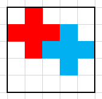

# Historia

Alexander está pintando un cuaderno de dibujo muy peculiar. El cuaderno se representa como una cuadrícula de $N \times N$, donde cada celda es de color blanco o negro.  
Naturalmente, las celdas **blancas** (`#`) son las que Alexander puede pintar como quiera, mientras que las **negras** (`.`) no se pueden modificar.

A Alexander le fascinan las cruces, así que quiere llenar todos los espacios blancos utilizando **cruces de $3 \times 3$**.  
Además, para que se vean diferentes, desea pintar **cada cruz de un color distinto**.

Tu tarea es ayudarle a determinar cuántos colores necesitará para cubrir completamente todos los espacios blancos con cruces.  
Si no es posible cubrir todo usando solo cruces de $3 \times 3$ sin que se sobrepongan ni se salgan de la cuadrícula, debes imprimir `-1`.

# Problema

Se te dará una matriz de caracteres de dimensiones $N \times N$.  
Cada carácter puede ser:

- `#` → una celda blanca que puede ser parte de una cruz.
- `.` → una celda negra que no puede ser modificada ni utilizada.

Tu tarea es calcular la **cantidad de colores necesarios** (es decir, la cantidad de cruces distintas que se deben usar) para cubrir todas las celdas blancas con cruces de $3 \times 3$, o imprimir `-1` si no es posible hacerlo.

## Entrada

- Un número entero $N$ indicando el tamaño de la cuadrícula.
- A continuación, $N$ líneas con $N$ caracteres (`#` o `.`), representando la cuadrícula.

## Salida

- Un entero: la cantidad de colores necesarios, o `-1` si no es posible cubrir toda la cuadrícula con cruces.

## Ejemplos

||input
3  
.#.  
###  
.#.  
||output
1  
||description
Los espacios disponibles forman exactamente una cruz.
||input
5  
.#...  
####.  
.####  
...#.  
.....  
||output
2  
||description
Ver imagen de abajo.
||input
4  
####  
####  
####  
####  
||output
-1  
||input
5  
..#..  
..#..  
#####  
..#..  
..#..  
||output
-1  
||description
Recuerda que las cruces deben ocupar exactamente un área de $3 \times 3$
||end

  
Solución del segundo ejemplo.

## Límites

- $3 \leq N \leq 100$
- Los caracteres de la matriz son únicamente `#` o `.`