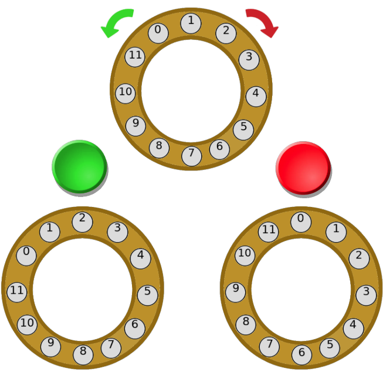

El malvado Doctor Doofen-Karel-Shmirtz está experimentando con una nueva fórmula secreta para la creación de zombis. Actualmente, cuenta con $N$ muestras y una máquina gigantesca capaz de analizarlas. La máquina tiene forma de anillo, donde las muestras están posicionadas alrededor del mismo de forma contigua (en sentido de las manecillas del reloj). Para analizar las muestras, baja del cielo un anillo similar que las examina.

Sin embargo, estas muestras son delicadas y algunas solo pueden ser analizadas correctamente si la máquina las examina en la posición adecuada. En otras palabras, para cada muestra $i$ solo existen algunas posiciones $j$ donde la muestra es analizada correctamente.

El Doctor Doofen-Karel-Shmirtz es consciente de esto, por lo que la máquina de muestras se puede rotar hacia la izquierda o hacia la derecha. Rotar todas las muestras una posición a la derecha o una posición a la izquierda cuesta $1$ de esfuerzo al Doctor. Realizar un análisis en las muestras actuales no consume esfuerzo ya que solo implica presionar un botón. Ayuda al Doctor a determinar la cantidad mínima de esfuerzo necesario para analizar todas las muestras correctamente.

# Problema

Se cuenta con $N$ muestras numeradas del $0$ al $N-1$. Inicialmente, las muestras se colocan en un círculo donde la muestra $i$ se encuentra en la posición $i$. Para cada muestra, se te proporcionará una lista de $lugares_i$ que indica las posiciones donde la muestra $i$ puede ser analizada correctamente. Para cada rotación, se puede realizar un análisis sin costo de esfuerzo; no obstante, rotar las muestras tiene un costo de $1$ en esfuerzo.

Tu tarea será determinar la cantidad mínima de esfuerzo necesario para que todas las muestras sean analizadas correctamente.

# Entrada

Se te dará un número $N$ indicando la cantidad de muestras.

En las siguientes $N$ líneas se te proporcionará un entero $l_i$ que es la cantidad de posiciones donde la muestra $i$ es válida. Seguido se te darán $l_i$ enteros indicando las posiciones $p_{ij}$.

# Salida

Un entero indicando la cantidad mínima de esfuerzo necesario.

# Ejemplos

||input
4
1 1
1 2
1 3
2 3 2
||output
1
||description
Al inicio, la muestra $3$ se encuentra en la posición $3$, por lo que podemos analizarla sin esfuerzo. Para todas las demás, debemos rotar las muestras una vez a la derecha.
||input
5
1 4
1 2
1 3
5 0 1 2 3 4
2 4 0
||output
3
||end

# Límites

- $1 \leq N \leq 10^5$.
- $1 \leq l_i \leq N$.
- $0 \leq p_{ij} < N$.
- $l_0 + ... + l_{N-1} \leq 3 \times 10^5$.
- Todas las subtareas están agrupadas.

**Subtarea 1 [7 puntos]**

- $N = 2$

**Subtarea 2 [13 puntos]**

- $N = 3$

**Subtarea 3 [12 puntos]**

- $l_i = 1$
- $p_{(1, 0)} = p_{(2, 0)} = ... = p_{(N - 1, 0)}$

**Subtarea 4 [15 puntos]**

- $10^4 \leq N \leq 10^5$
- $i \leq p_{ij} \leq \min(N, i + 100)$.

**Subtarea 5 [20 puntos]**

- $N \leq 100$

**Subtarea 6 [33 puntos]**

- Sin restricciones adicionales