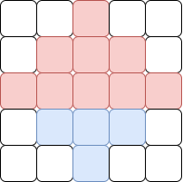
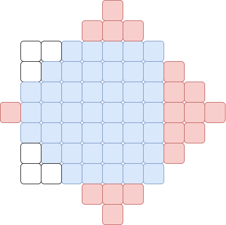
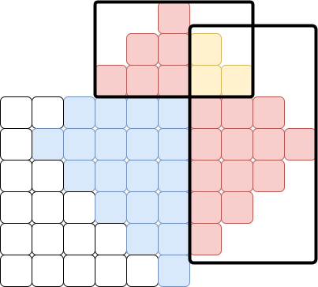

# Solución

Supongamos que tenemos una función $f(d)$ que, dado el día $d$, nos indica la cantidad de zonas infectadas en ese día, con $f(1) = 1$.

Es claro que esta función es _no-decreciente_. Esto significa que la cantidad de zonas infectadas solo puede aumentar ($f(d) \leq f(d + 1)$). Si tuviéramos esta función mágica, una idea sería iterar día por día hasta encontrar el primer día en el que $f(d) \geq i$. Sin embargo, debido a las limitaciones de tiempo, esta idea no es viable ya que su complejidad es lineal $O(N)$ en el peor de los casos, con $N = 10^8$, y disponemos de solo $0.1$ segundos.

Dado que $f(d)$ es una función no-decreciente, podemos buscar el primer día $d$ que cumpla $f(d) \geq k$ usando **búsqueda binaria**. La propiedad binaria aquí es _si ya se superó el límite_ $k$. Nota que a partir del momento en que se supera el límite, la cantidad de zonas infectadas siempre excederá dicho límite. Haciendo una búsqueda binaria, reducimos nuestra complejidad a $O(\log N)$, que es más que suficiente para el tiempo que se nos da.

```cpp
int64_t busqueda_binaria(int l, int r, int N, int64_t K, int x, int y) {
    if (l == r) return l;
    int mit = (l + r) / 2;
    if (calc_infectados(N, x, y, mit) >= K)
        return busqueda_binaria(l, mit, N, K, x, y);
    else
        return busqueda_binaria(mit + 1, r, N, K, x, y);
}
```

Recuerda que la búsqueda binaria necesita un rango dentro del cual trabajar. El primer día es $1$, así que $l = 1$. Sin embargo, falta determinar cuál sería el posible último día, y ese es justamente $2N - 1$. En ese día máximo, todas las zonas habrán sido infectadas.

Una última aclaración es que si $f(d)$ fuera una fórmula fácil de despejar, podríamos obtener la respuesta en $O(1)$, pero ese no será el caso para este problema.

## Deduciendo la fórmula

Muy bien, ya resolvimos una tercera parte del problema; ahora falta encontrar $f(d)$. ¿Cómo se vería la función si no existieran los bordes del mundo? Intenta calcular la cantidad de zonas infectadas para un cierto día, suponiendo que los bordes del mundo no existen.

Nota que se forma una pirámide superior de altura $d$ y una inferior de altura $d-1$.



Para calcular la cantidad de elementos en una pirámide de altura $d$, es equivalente a obtener la suma de los primeros $d$ elementos impares. La suma de los primeros $d$ elementos impares es igual a $d^2$; solo debemos usar la fórmula de Gauss y acomodar los términos de forma correcta para deducirlo.

$$
\begin{aligned}
1 + 3 + 5 + ... + 2d - 1 &= [2(1) - 1] + [2(2) - 1] + [2(3) - 1] + ... + [2(d) - 1] \\
&= 2(1) + 2(2) + 2(3) + ... + 2(d) - (1 + 1 + ... + 1) \\
&= 2(1 + 2 + 3 + ... + d) - d \\
&= 2 \times \left( \frac{d (d + 1)}{2} \right) - d \\
&= d^2
\end{aligned}
$$

```cpp
int64_t infectados = D * D + (D - 1) * (D - 1);
```

El problema es que los bordes del mundo hacen que ciertas partes se recorten. Entonces, a nuestro cálculo debemos restarle algo. Notemos que para cada una de las cuatro direcciones, la forma en que se desborda (si solo tomamos en consideración "la pirámide de ese lado") es justamente otra pirámide de cierta altura.



No es difícil calcular las alturas de las pirámides de los lados que se desbordan. Por ejemplo, para el este, si estoy en la posición $(x, y)$ y han pasado $d$ días, entonces el punto más lejano a la derecha que puedo alcanzar es $x + d - 1$. Si esa cantidad supera $N$, entonces hay una pirámide de altura $N - (x + d - 1)$ desbordándose al este, y podemos hacer un análisis similar para cada una de las direcciones. Entonces, hay que remover ese exceso de elementos que estamos contando.

```cpp
int64_t exceso_norte = max((int64_t)0, y + D - 1 - N),
        exceso_sur = max((int64_t)0, D - y),
        exceso_este  = max((int64_t)0, x + D - 1 - N),
        exceso_oeste  = max((int64_t)0, D - x);

infectados -= exceso_norte * exceso_norte
            + exceso_sur * exceso_sur
            + exceso_este  * exceso_este
            + exceso_oeste  * exceso_oeste;
```

Hasta ahora todo bien, pero como notarás, nuestra fórmula aún tiene un pequeño defecto: las esquinas del mundo. En cada una de las esquinas, si nuestra figura llega a ser muy grande, habrá dos pirámides tocándose, y esos elementos que estamos _eliminando_ al restar las pirámides, en realidad los estamos eliminando dos veces.



Nota que ese traslape es únicamente una parte de una pirámide, en este caso una _media pirámide_ de altura $d$. La suma de los elementos desde $1$ hasta $d$ se obtiene utilizando la fórmula de Gauss. Para obtener la altura de la media pirámide, podemos usar la información de la altura de las pirámides anteriores. Por ejemplo, sabemos que estamos en la posición $(x, y)$ y que por el este se desborda con una pirámide de altura $k$. Entonces, esa pirámide se extenderá a la esquina noreste (superior derecha) por $y + k - 1$, y si eso supera $N$, quiere decir que tenemos una media pirámide de altura $N - (y + k - 1)$ que estamos contando doble.

De esta forma hemos completado nuestra función $f(x)$ que nos calcula la cantidad de zonas infectadas para cierto día.

```cpp
int64_t gauss(int64_t N) {
    return (N) * (N + 1) / 2;
}

int64_t calc_infectados(
    int64_t N, 
    int64_t x,
    int64_t y,
    int64_t D
) { 
    int64_t infectados = D * D + (D - 1) * (D - 1);
    int64_t exceso_norte = max((int64_t)0, y + D - 1 - N),
            exceso_sur = max((int64_t)0, D - y),
            exceso_este  = max((int64_t)0, x + D - 1 - N),
            exceso_oeste  = max((int64_t)0, D - x);

    infectados -= exceso_norte * exceso_norte
                + exceso_sur * exceso_sur
                + exceso_este  * exceso_este
                + exceso_oeste  * exceso_oeste;

    int64_t traslape_no = max((int64_t)0, exceso_norte - x),
            traslape_ne = max((int64_t)0, exceso_este - (N - y + 1)),
            traslape_so = max((int64_t)0, exceso_sur - x),
            traslape_se = max((int64_t)0, exceso_este - y);
    
    infectados += gauss(traslape_ne) 
                + gauss(traslape_no) 
                + gauss(traslape_se) 
                + gauss(traslape_so);

    return infectados;
}
```