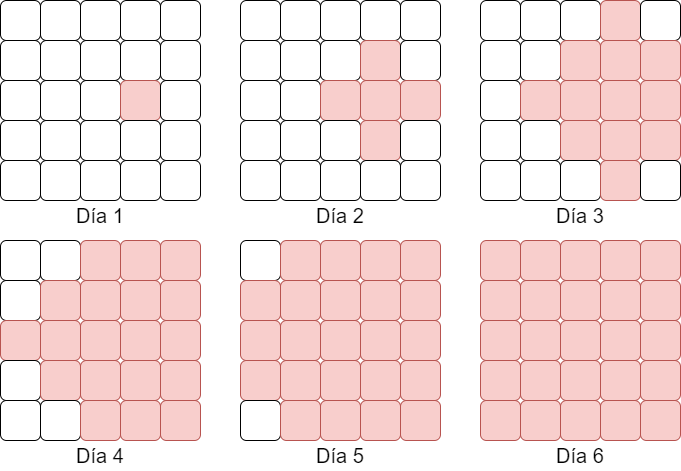

Claro, aquí tienes el texto corregido:

# Problema

Para los que no conozcan a Karel el robot, es un individuo que vive en un mundo que es una matriz de $N \times N$. Las calles y avenidas dividen el mundo de Karel en forma de cuadrícula, donde cada persona solo se puede mover en alguna de las cuatro direcciones (Norte, Sur, Este y Oeste).

Un día las cosas en la ciudad parecían muy tranquilas hasta que de repente al malvado Doctor Doofen-Karel-Shmirtz se le fue un experimento de las manos y ahora ¡había Karel-zombies en la ciudad! Para la suerte de los ciudadanos, la infección zombie se propagaba de forma muy lenta y Karel (el original) estaba allí listo para hacer un plan de contingencia. El plan consiste en evacuar a la mayor cantidad de gente posible; cuando la cantidad de lugares infectados sea **mayor o igual** que cierto $K$, se llamará a Super-Karelman para que pelee contra la infección zombie con la libertad de destruir edificios y usar todo su poder.

La infección se origina en la casilla $(x, y)$ (recordemos que en el mundo de Karel las columnas y filas van del $1$ al $N$). Por la naturaleza del mundo de Karel, si un lugar se encuentra infectado, la infección se expande al siguiente día a las zonas adyacentes (Norte, Sur, Este y Oeste). A continuación se muestra un ejemplo de cómo avanzaría una infección en un mundo de $5 \times 5$.

Dada toda la información proporcionada, Karel quiere que lo ayudes a determinar qué día tendría que llamar a Super-Karelman.

# Entrada

Se te darán los 4 enteros $N, K, x, y$ descritos anteriormente.

# Salida

Un único entero indicando el día que deberá llegar Super-Karelman.

# Ejemplos

||input
5 10 4 3
||output
3
||description
Se nos da $N = 5$, $(x, y) = (4, 3)$ que es justamente el caso mostrado en la figura de la descripción. Únicamente hay que ver qué día la cantidad de lugares infectados supera o es igual a $K = 10$ y podemos ver que es justamente en el tercer día que hay $12$ infectados.
||input
1 1 1 1
||output
1
||input
5 13 3 3
||output
3
||input
4 16 1 1
||output
7
||end

# Límites

- Todas las subtareas se encuentran agrupadas.

**Subtarea 1 [8 puntos]**

- $1 \leq N \leq 100$
- $K = N^2$
- $(x, y) = (1, 1)$

**Subtarea 2 [10 puntos]**

- $1 \leq N \leq 10^6$
- $1 \leq K \leq N^2$
- $(x, y) = (1, 1)$

**Subtarea 3 [11 puntos]**

- $1 \leq N \leq 10^6$
- $1 \leq K \leq N^2$
- $1 \leq x, y \leq N$
- Se te asegura que la infección superará K antes de topar con el borde del mundo.

**Subtarea 4 [12 puntos]**

- $1 \leq N < 10^8$
- $1 \leq K \leq N^2$
- $N$ es impar
- $x = y = \frac{N + 1}{2}$

**Subtarea 5 [14 puntos]**

- $1 \leq N \leq 50$
- $1 \leq K \leq N^2$
- $1 \leq x, y \leq N$

**Subtarea 6 [17 puntos]**

- $1 \leq N \leq 10^3$
- $1 \leq K \leq N^2$
- $1 \leq x, y \leq N$

**Subtarea 7 [28 puntos]**

- $1 \leq N \leq 10^8$
- $1 \leq K \leq N^2$
- $1 \leq x, y \leq N$