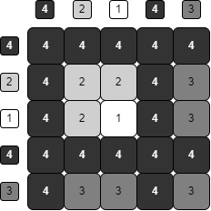
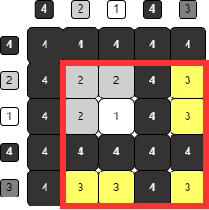

# Problema

Muchos exolímpicos han experimentado con la pintura, como Santy cuando estaba _pintando la pared_ o _el arte de Leonardo_. Alonso no iba a ser la excepción, por lo que decidió introducirse al mundo de la pintura e inventar su propia técnica llamada *monocromatismo*.

La técnica consiste en crear una pintura en escala de grises en un lienzo cuadrado. El lienzo se divide en una matriz de $N \times N$ cuadrados (simulando los píxeles de una computadora). Luego, seleccionas $N$ escalas de grises entre $1$ y $K$, donde $1$ es el color blanco, $K$ es negro, y los demás colores son escalas de grises más oscuras cuanto mayor sea el número.

Entonces, tenemos una selección de grises $a_1, ..., a_N$. En la posición $(i, j)$ del lienzo pintamos con los colores $(a_i, a_j)$. Alonso no sabía esto, pero cuando se pintan dos escalas de grises en un punto, el color más fuerte predomina; es decir, la posición $(i, j)$ queda con el color $\max(a_i, a_j)$. Por ejemplo, si los colores seleccionados fueran $\{4, 2, 1, 4, 3\}$, el lienzo se vería como la siguiente imagen:

Sin embargo, el mundo de la pintura puede ser duro, especialmente por los críticos. Cada crítico tiene su escala de gris favorita $1 \leq i \leq K$. Un crítico le da un puntaje a la pintura de Alonso dependiendo de qué tan bien está representada su escala de gris favorita. En particular, la puntuación que le dan es **la suma de los lados del rectángulo más pequeño que contiene a todos los cuadrados de su escala de gris favorita**. En el ejemplo anterior, si a un crítico le gusta la escala $3$, entonces su puntuación sería $4 + 4 = 8$ ya que el rectángulo más pequeño que contiene a todos los cuadros pintados de $3$ es de $4 \times 4$.

Ayuda a Alonso a determinar la puntuación que le daría cada uno de los críticos a su lienzo final.

# Entrada

Se te darán los enteros $N$ y $K$ indicando la cantidad de escalas de grises seleccionadas y las escalas disponibles.

En la segunda línea se te darán los enteros $a_1, ..., a_N$ que indican las escalas usadas por Alonso para su lienzo.

# Salida

Debes imprimir $K$ enteros, donde el $i$-ésimo entero indica la calificación que le daría un crítico con gusto en la $i$-ésima escala.

# Ejemplos

||input
5 4
4 2 1 4 3
||output
2 4 8 10
||description
Es el ejemplo descrito en el problema.
||input
3 2
1 2 1
||output
6 6
||input
7 4
1 3 4 2 2 1 3
||output
12 12 14 14
||end

# Límites

- Todas las subtareas estan agrupadas.
- $K \leq N$.
- $1 \leq a_i \leq K$.

**Para un 18% de los casos:**

- $1 \leq K, N \leq 100$

**Para un 24% de los casos:**

- $1 \leq K, N \leq 10^3$

**Para un 14% de los casos:**

- $1 \leq K = N \leq 10^5$
- $1 = a_1 < a_2 < ... < a_N = K$

**Para un 14% de los casos:**

- $1 \leq N \leq 10^5$
- $K = 2$

**Para un 30% de los casos:**

- $1 \leq K, N \leq 10^5$

---