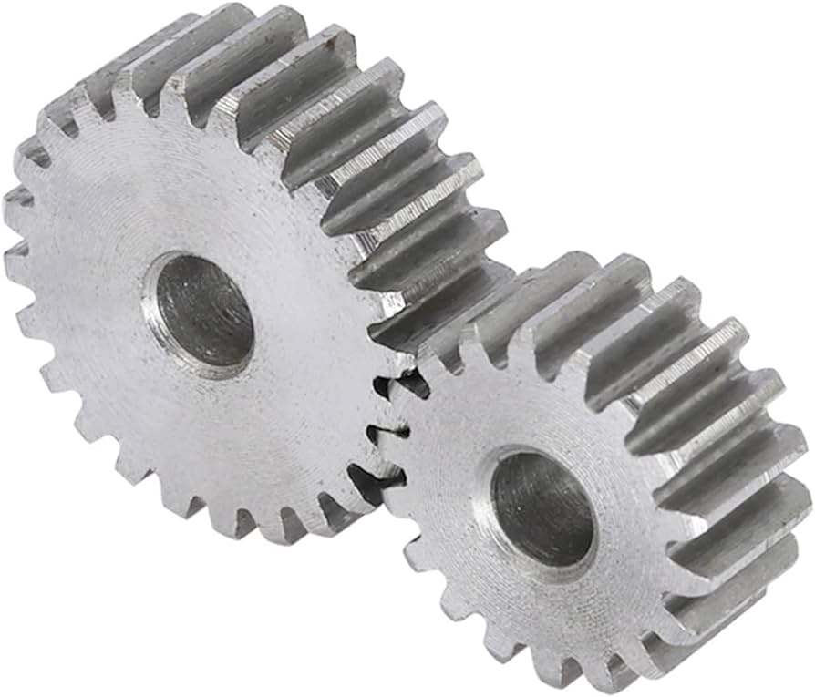

# Problema

Sebastián decidió dedicarse a la industria mecánica. Una de sus grandes pasiones es diseñar engranajes, y es capaz de diseñarlos con cualquier cantidad de dientes. Un día, el millonario Santiago decidió ponerle el reto más grande que ha tenido en toda su carrera el ingeniero Hernández (apellido de Sebastián).

Sebastián tiene un total de $N$ diseños de engranajes, cada uno de estos tiene $a_i$ dientes. Sebastián debe construir una máquina donde cada posible pareja de engranajes motorice una parte distinta. Por ejemplo, digamos que tiene diseños con $[10, 5, 15]$ dientes. Entonces, una parte de la máquina funciona con los engranajes $(10, 5)$, otra con los $(10, 15)$ y finalmente otra con $(5, 15)$.

Para que una parte de la máquina funcione correctamente, los engranajes deben volver a su estado inicial. Imagina que marcamos los dientes de cada engranaje con distinto color. Entonces, después de $10$ vueltas, la parte que funciona con $(10, 5)$ vuelve a su estado inicial. A esto le llamamos una **revolución**. Por otro lado, la revolución del $(10, 15)$ se da después de $30$ movimientos. Por lo tanto, cada parte de la máquina tiene una revolución distinta. Si se salta alguna revolución, la máquina puede fallar de forma crítica.

Ahora, el mayor reto de este desafío es hacer que la máquina funcione lo más rápido posible. Sebastián puede acelerar la máquina en cualquier cantidad de movimientos. Si acelera la máquina en $2$, entonces todos los engranajes empiezan a moverse de dos en dos. Digamos que tenemos una parte con revolución $10$, si aceleramos la máquina en $3$, es muy probable que se rompa porque se saltaría la primera revolución de esa parte. De la misma forma, si lo aceleramos en $20$, también hay riesgo de que la máquina se rompa. Pero si lo aceleramos en $10$, $5$ o $2$, no habría problema.

La pregunta es: ¿Cuál es la máxima aceleración que puede alcanzar Sebastián sin que haya riesgo de que la máquina se rompa?

# Entrada

Se te dará un número $N$ indicando la cantidad de diseños que tiene Sebastián. En la siguiente línea, se te darán $N$ enteros $a_i$ que representan los diseños de Sebastián.

# Salida

Deberás imprimir un entero que representa la máxima aceleración que puede alcanzar Sebastián.

# Ejemplos

||input
3
10 5 15
||output
5
||description
Las revoluciones son $10, 15, 30$, entonces la máxima aceleración posible sería $5$.
||input
4
10 24 40 80
||output
40
||end

# Límites

- $2 \leq N \leq 10^5$
- $1 \leq a_i \leq 4 \times 10^5$
- Todas las subtareas se encuentran agrupadas.

**Subtarea 1 [6 puntos]**

- $N = 2$.

**Subtarea 2 [15 puntos]**

- Todos los $a_i$ son una potencia de $2$.

**Subtarea 3 [20 puntos]**

- Todos los $a_i$ son números primos.

**Subtarea 4 [24 puntos]**

- $N \leq 100$.

**Subtarea 5 [35 puntos]**

- Sin restricciones adicionales.