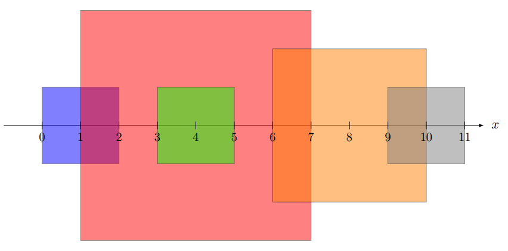

# Problema

Muchos dicen que Picasso es el precursor del cubismo con su arte moderno. Pero, ¿alguna vez han escuchado de Elian Flores? Gran artista que innovó con la forma de hacer sus cuadros.

Sus cuadrados parecían muy simples. Elian dibujaba un total de $N$ cuadrados, a veces del mismo color y a veces de colores distintos. Cada cuadrado tenía un radio $r_i$, que definía la distancia del centro hacia sus lados, y además un centro ubicado en la posición $c_i$ sobre el eje de referencia. Todos los cuadrados pintados se dibujaban centrados en dicho eje.

Como podrás notar, ciertos cuadrados en la pintura se traslapan. Un día llegó el crítico de arte Santiago y, horrorizado por esto, decidió que la puntuación de la pintura se basaría únicamente en el área total cubierta, y no en el área total pintada. Tu tarea en este problema será determinar justamente cuál es el área total cubierta por la pintura.

# Entrada

Se te dará un número $N$ indicando la cantidad de cuadrados. Luego, se proporcionará una línea de $N$ enteros $c_i$ representando la posición de cada cuadrado sobre el eje de referencia. Finalmente, se te proporcionará una línea de $N$ enteros $r_i$, que indica la distancia del centro hacia los lados de los cuadrados.

# Salida

Deberás imprimir el área total cubierta por la figura.

# Ejemplos

||input
5  
4 4 10 8 1  
3 1 1 2 1  
||output
52  
||description
Es la imagen del ejemplo.
||end

# Límites

- $1 \leq N \leq 10^5$.
- $1 \leq r_i \leq 10^6$.
- $1 \leq c_i \leq 10^9$.

**Subtarea 1 [15 puntos]**

- Los cuadrados no se traslapan.

**Subtarea 2 [20 puntos]**

- $1 \leq N \leq 100$.
- $1 \leq r_i \leq 100$.
- $1 \leq c_i \leq 1000$.

**Subtarea 3 [30 puntos]**

- $1 \leq N \leq 1000$.
- $1 \leq r_i \leq 500$.
- $1 \leq c_i \leq 10^6$.

**Subtarea 4 [35 puntos]**

- Sin restricciones adicionales.