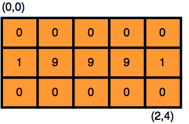
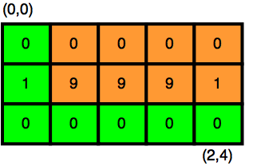
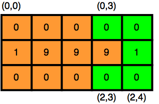

# Problema

Timmy Turner es un chico muy afortunado porque tiene hadas que le conceden deseos. Estas hadas se llaman padrinos mágicos. Los padrinos mágicos pueden cumplir casi cualquier deseo, pero con ciertas condiciones.

Un día, analizando el mapa de Dimmsdale, Timmy encontró una zona bastante curiosa. Toda la zona era de Doug Dimmadome y tenía muchas empresas. La zona se puede ver como una matriz de $N \times M$, donde cada una de las empresas genera $a_i$ de dinero. Timmy pidió deseos de la forma "Dame todo el dinero que hay entre el puesto $p_{j1}$ y el $p_{j2}$". 

No obstante, como dictan las reglas de los padrinos mágicos, tienen que buscar la forma de economizar el dinero que dan. Por tanto, le dan la mínima cantidad posible para ir desde $p_{j1}$ hasta $p_{j2}$. Los padrinos mágicos te pidieron ayuda para calcular cuál sería esta cantidad.

Un camino desde un punto hasta otro en la matriz se define como una serie de casillas adyacentes (arriba, izquierda, derecha o abajo) que te lleven desde una casilla a otra.

# Entrada

Dos enteros $N$ y $M$ que definen las dimensiones del lugar. Luego, se te darán los $N \times M$ enteros $c_{(i, j)}$ que representan las ganancias de las empresas.

Luego, se te dará un entero $Q$ que representa la cantidad de preguntas que se te harán. Seguido, $Q$ líneas de cuatro enteros $(a_{i_1}, a_{i_2}, b_{i_1}, b_{i_2})$ que representan la $i$-ésima pregunta.

# Salida

Para cada una de las preguntas, deberás imprimir la mínima cantidad de dinero que le puedes dar a Timmy.

# Ejemplos

||input
3 5
0 0 0 0 0
1 9 9 9 1
0 0 0 0 0
3
0 0 2 4
0 3 2 3
1 1 1 3
||output
1
1
18
||end

El lugar originalmente se ve como:

La respuesta a la primera pregunta se puede obtener eligiendo el siguiente camino:

La segunda pregunta se resuelve mediante el siguiente camino:

# Límites

- $1 \leq N \leq 7$
- $1 \leq M \leq 5 \times 10^3$
- $1 \leq Q \leq 4 \times 10^4$
- $0 \leq c_{(i, j)} \leq 10^3$
- $0 \leq a_{i_1}, b_{i_1} < N$
- $0 \leq a_{i_2}, b_{i_2} < M$
- Todas las subtareas se encuentran agrupadas.

**Subtarea 1 [10 puntos]**

- $c_{(i, j)} = 1$

**Subtarea 2 [12 puntos]**

- $N = 1$

**Subtarea 3 [15 puntos]**

- Para todo $i$, excepto uno, $c_{(i, j)} = 0$ (como en el caso de ejemplo).

**Subtarea 4 [28 puntos]**

- $1 \leq M, Q \leq 100$

**Subtarea 5 [35 puntos]**

- Sin restricciones adicionales.