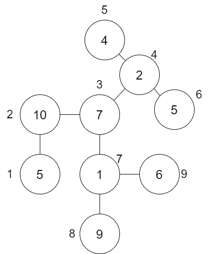
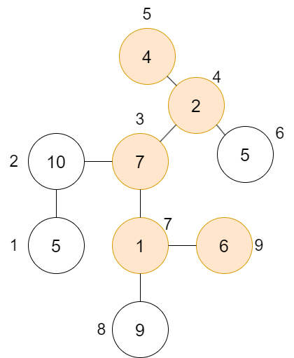
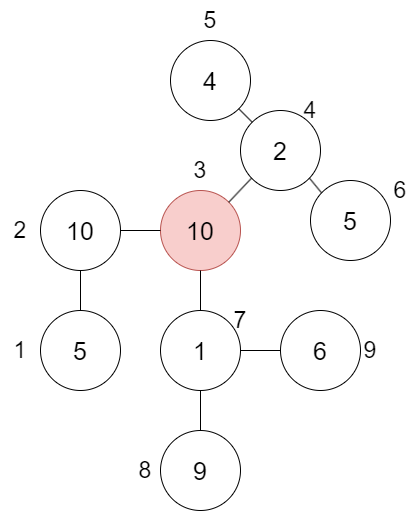
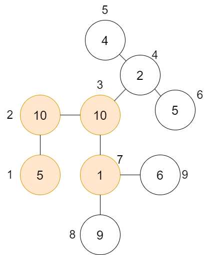

# Problema

Un día Boris visitó un parque de atracciones llamado Six Flags. Lo interesante de este Six Flags es que todas las atracciones están conectadas por un *único camino*. Es decir, si deseas ir de la atracción $A$ a la $B$, hay una única forma de llegar sin pasar dos veces por el mismo lugar.

Boris ideó un gran plan para aprovechar al máximo su visita y superar sus miedos. Si quiere subirse a las atracciones $A$ y $B$, tendrá que subirse también a todas las atracciones que están en el camino entre $A$ y $B$. Lo bueno es que el parque cuenta con una avanzada app que muestra los tiempos de espera de cada atracción.

Boris te ha pedido ayuda para determinar cuánto tiempo pasará en las filas si decide ir entre dos atracciones. A veces puede cambiar de opinión o simplemente ya ha terminado una ruta y quiere subirse a más juegos; por lo tanto, deberás responder varias de estas preguntas.

¿Pensabas que eso era todo? No, ya que los tiempos de espera no siempre son los mismos. A veces, la app notifica que el tiempo de espera de una atracción $A$ ha cambiado a $x$. Tu tarea será procesar tanto los cambios en los tiempos de espera como las consultas de Boris.

# Entrada

Se te dará un número entero $N$, que indica la cantidad de atracciones en el parque.

En la siguiente línea, recibirás $N$ enteros $t_i$ que representan los tiempos de espera de cada juego inicialmente.

En las siguientes $N-1$ líneas, se describe el mapa del parque de atracciones. Se te darán dos enteros $a_i$ y $b_i$, que indican que existe un camino entre las atracciones $a_i$ y $b_i$ (los caminos son bidireccionales, ni que fueran carreteras).

A continuación, se te dará un entero $Q$, que representa la cantidad de operaciones a procesar.

En las siguientes $Q$ líneas, recibirás un carácter $c$:

- Si $c$ es `?`, se te darán dos enteros $a_i$ y $b_i$. Deberás responder el tiempo total de espera en las filas si Boris se sube a todas las atracciones desde $a_i$ hasta $b_i$.
- Si $c$ es `+`, se te darán dos enteros $a_i$ y $t_i$. Esto significa que el tiempo de espera de la atracción $a_i$ ha sido actualizado a $t_i$.

# Salida

Para cada una de las operaciones `?`, deberás imprimir la respuesta correspondiente en el orden en que se te dieron.

# Ejemplos

||input
9
5 10 7 2 4 5 1 9 6
1 2
2 3
3 4
3 7
4 5
4 6
7 8
7 9
3
? 5 9
+ 3 10
? 1 7
||output
20
26
||description
Ver abajo.
||end

Podemos dibujar el mapa de Six Flags de la siguiente manera:

La primera pregunta es la suma de los tiempos de espera desde la atracción 5 hasta la 9, que es:

Luego, la atracción 3 actualiza su tiempo de espera a 10:

Finalmente, la suma de los tiempos de espera desde la atracción 1 hasta la 7 es 26:

# Límites

- $1 \leq N, Q \leq 10^5$
- $1 \leq a_i, b_i \leq N$
- $c_i =$ `+`, `?`
- $1 \leq t_i \leq 10^6$
- Todas las subtareas están agrupadas.

**Subtarea 1 [20 puntos]**

- Cada atracción tiene a lo sumo un camino hacia otras dos atracciones.

**Subtarea 2 [20 puntos]**

- $N, Q \leq 100$.

**Subtarea 3 [20 puntos]**

- $t_i = 1$.

**Subtarea 4 [20 puntos]**

- Solo hay operaciones del tipo `?`.

**Subtarea 5 [20 puntos]**

- Sin restricciones adicionales.
